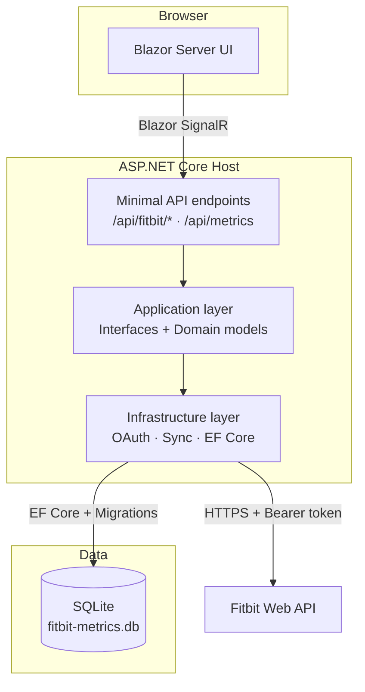

# Fitbit Metrics

A personal health metrics dashboard built with **.NET 10**, **Blazor Server**, and **SQLite**, pulling daily data from the Fitbit Web API. Built as a portfolio piece demonstrating production-style .NET practices, and used personally as a daily health tracker.

## What it does

Connects to Fitbit via **OAuth 2.0 Authorization Code flow**, syncs selected health and nutrition metrics into a local SQLite database, and presents them on an interactive Blazor dashboard. Sync can be triggered manually or run automatically on a schedule.

## Architecture



## Engineering highlights

Deliberate design choices that reflect production-style thinking:

| Area | Decision | Rationale |
|---|---|---|
| **Layering** | `Application` holds only interfaces + domain models; `Infrastructure` owns all I/O | Core logic stays dependency-free and independently testable |
| **OAuth 2.0** | Full Authorization Code flow with per-request state nonce stored in `IMemoryCache` | Demonstrates real-world CSRF protection, not just happy-path auth |
| **Token refresh** | Proactive refresh with 2-minute expiry buffer | Prevents sync failures mid-operation rather than reacting after a 401 |
| **Sync idempotency** | Unique `(UserKey, MetricDate)` DB constraint + merge-on-conflict in service layer | Safe to re-run for the same date range without duplicating rows |
| **Nullable metrics** | All health fields are nullable with partial-availability by design | Reflects real API variability; `null` means "not provided", not "error" |
| **Options validation** | `FitbitApiOptions` bound with `ValidateOnStart()` | Fails fast at startup rather than on the first user request |
| **HttpClient** | Typed client registered via `IHttpClientFactory` | Follows Microsoft guidance; avoids socket exhaustion from `new HttpClient()` |
| **Migrations** | EF Core migrations applied automatically on startup | Zero-friction local setup; schema always in sync with code |

## Tracked metrics

| Metric | Unit | Fitbit endpoint |
|---|---|---|
| Resting heart rate | bpm | `activities/heart` |
| HRV – daily RMSSD | ms | `hrv/date/` |
| VO2 Max / cardio fitness score | ml/kg/min | `cardioscore/date/` |
| Calories consumed | kcal | `foods/log/date/` |
| Carbohydrates | g | ↑ nutrition summary |
| Fat | g | ↑ nutrition summary |
| Protein | g | ↑ nutrition summary |
| Fiber | g | ↑ nutrition summary |
| Sodium | mg | ↑ nutrition summary |
| Potassium | mg | ↑ nutrition summary |
| Calcium | mg | ↑ nutrition summary |
| Iron | mg | ↑ nutrition summary |

> HRV, VO2 Max, and some micronutrients depend on device capability and Fitbit account data. Missing fields are stored as `null` and shown as `—` in the dashboard.

## Solution layout

```
src/
  FitbitMetrics.Application/    # Domain models + service interfaces (no I/O)
  FitbitMetrics.Infrastructure/ # EF Core, Fitbit API client, OAuth and sync services
  FitbitMetrics.Web/            # Blazor Server UI + minimal API endpoints
tests/
  FitbitMetrics.Tests/          # Persistence and integration tests
```

## Local setup

### Prerequisites
- .NET 10 SDK
- A Fitbit account and a registered Fitbit app

### 1. Register a Fitbit app

Go to [dev.fitbit.com/apps/new](https://dev.fitbit.com/apps/new) and create an app with:
- **Application Type**: Personal
- **OAuth 2.0 Application Type**: Personal
- **Callback URL**: `https://localhost:5001/api/fitbit/callback`

### 2. Store credentials (never committed to source)

```powershell
dotnet user-secrets --project .\src\FitbitMetrics.Web\FitbitMetrics.Web.csproj set "FitbitApi:ClientId" "<your-client-id>"
dotnet user-secrets --project .\src\FitbitMetrics.Web\FitbitMetrics.Web.csproj set "FitbitApi:ClientSecret" "<your-client-secret>"
dotnet user-secrets --project .\src\FitbitMetrics.Web\FitbitMetrics.Web.csproj set "FitbitApi:RedirectUri" "https://localhost:5001/api/fitbit/callback"
```

### 3. Run

```powershell
dotnet run --project .\src\FitbitMetrics.Web\FitbitMetrics.Web.csproj
```

The database is created and migrated automatically on first run. Navigate to `https://localhost:5001`, click **Connect Fitbit**, then **Sync**.

## Notes

- **Single-user by design**: uses a fixed `demo-user` key; the schema and service layer are structured for future multi-user extension.
- **No secrets in source**: `appsettings.json` contains only `__SET_VIA_USER_SECRETS__` placeholders. All credentials live in user-secrets or environment variables.
- **Missing values are expected**: a `—` in the dashboard means Fitbit did not return that field for that day — not a sync error.

## Roadmap

- [ ] Summary cards with 7-day averages and trend direction indicators
- [ ] Line/sparkline charts for heart rate and HRV over time
- [ ] Daily scheduled auto-sync via hosted background service
- [ ] CSV export for custom date ranges
- [ ] OAuth token encryption at rest (ASP.NET Core Data Protection)
- [ ] Disconnect / token revoke flow
- [ ] Expanded test coverage: mapper edge cases, endpoint integration tests
