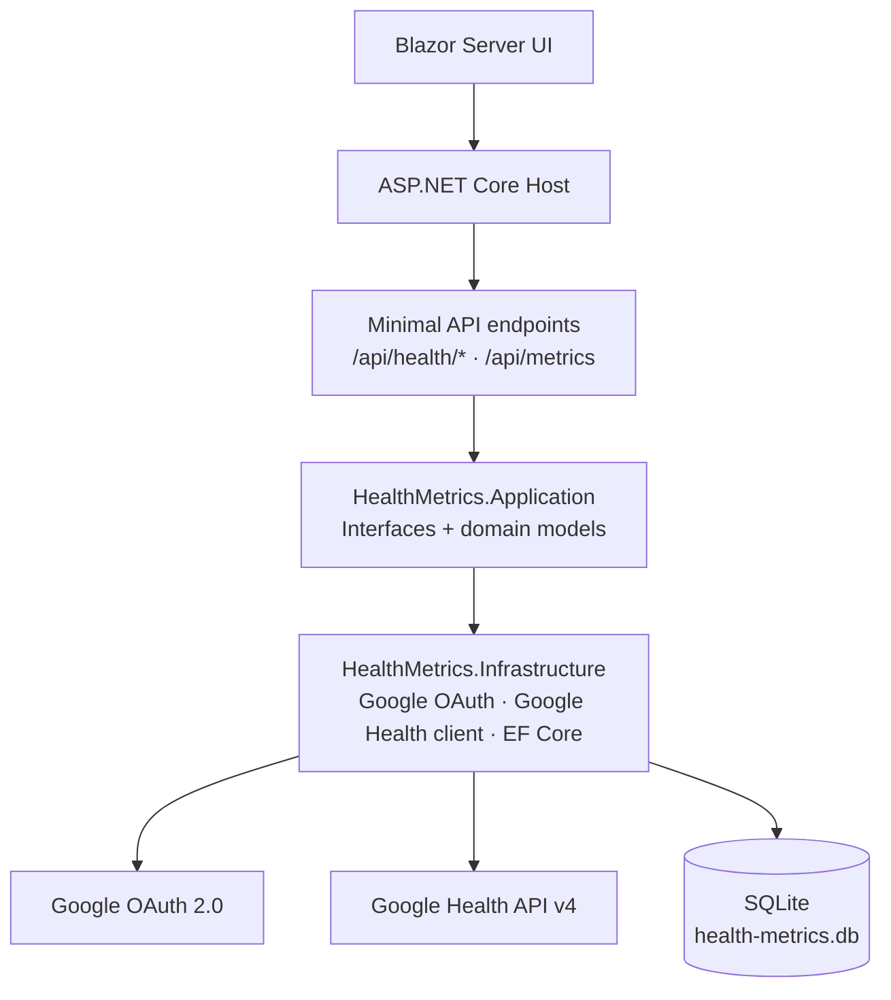

# Health Metrics

A personal health dashboard built with **.NET 10**, **Blazor Server**, **SQLite**, and the **Google Health API**. It is designed as both a daily-use health tracker and a recruiter-facing portfolio project that demonstrates production-style .NET architecture, OAuth security, API integration, persistence, migrations, resilience, and automated tests.

## What it does

- Connects to Google Health with **Google OAuth 2.0 Authorization Code flow** and offline refresh tokens.
- Syncs daily Google Health records into a local SQLite database.
- Shows date-range dashboard cards, a heart-rate/HRV trend chart, sync history, and a daily snapshot table.
- Supports deterministic demo data for portfolio walkthroughs without requiring live Google Health consent.
- Exports the current metric range as CSV.

## Why Google Health API

The legacy Fitbit Web API is being turned down in 2026. This project is a **direct cutover** to Google Health API rather than a compatibility wrapper around the old Fitbit endpoints. Existing legacy OAuth tokens cannot be transferred to Google OAuth, so users must grant consent again through Google.

## Architecture



## Engineering highlights

| Area | Implementation | Why it matters |
|---|---|---|
| **Layering** | `Application` contains provider-neutral interfaces/models; `Infrastructure` owns Google OAuth, REST, EF Core, and resilience | Keeps UI and domain code decoupled from Google response shapes |
| **OAuth security** | Google Auth library, one-time state nonce, offline consent, encrypted token persistence, best-effort revoke | Demonstrates real OAuth lifecycle work, not only happy-path redirects |
| **Token storage** | ASP.NET Core Data Protection with a Google-specific purpose string | Tokens are encrypted at rest in SQLite |
| **API client** | Typed `HttpClient` for `https://health.googleapis.com/v4/` plus transient-failure resilience | Avoids socket exhaustion and keeps HTTP policy centralized |
| **Observability** | Structured Serilog console/file logging plus privacy-safe Google Health request/response telemetry | Makes daily troubleshooting possible without leaking secrets or health payloads by default |
| **Daily sync** | Range-based sync, idempotent merge on `(UserKey, MetricDate)`, sync history records | Safe to re-run and transparent when a sync fails |
| **Data contract** | Active dashboard fields are limited to confirmed Google Health data types | Avoids permanently empty Fitbit-era columns |
| **Migration safety** | Legacy credentials are removed; useful historical metrics are preserved; retired columns are archived | Direct cutover without silently discarding historical personal data |
| **Tests** | Tests cover persistence, summaries, demo seed, Google Health client fixtures, endpoint behavior, migration safety, and logging redaction | Recruiter-visible quality signal |

## Active metric contract

| Dashboard field | Google Health source | Unit |
|---|---|---|
| Resting heart rate | `daily-resting-heart-rate` | bpm |
| Heart-rate variability | `daily-heart-rate-variability` | RMSSD ms |
| Run VO2 Max | `run-vo2-max` daily rollup | ml/kg/min |
| Calories consumed | `nutrition-log` daily rollup energy | kcal |
| Carbohydrates | `nutrition-log` daily rollup | g |
| Fat | `nutrition-log` daily rollup | g |
| Protein | `nutrition-log` nutrient rollup | g |

Missing values are normal: Google Health only returns data that exists for the user's device/account and granted scopes.

## Solution layout

```text
src/
  HealthMetrics.Application/     # Domain models + service interfaces
  HealthMetrics.Infrastructure/  # Google OAuth, Google Health REST client, EF Core, sync services
  HealthMetrics.Web/             # Blazor Server UI + minimal API endpoints
tests/
  HealthMetrics.Tests/           # Unit, persistence, client, and endpoint tests
docs/
  google-health-setup.md         # Google Cloud / OAuth setup
  google-health-data-contract.md # Source-to-domain mapping and query rules
  architecture.md                # Design notes and tradeoffs
```

## Local setup

### Prerequisites

- .NET 10 SDK
- A Google Cloud project with Google Health API enabled
- A Google OAuth web client configured for the local redirect URI

### 1. Configure Google Cloud

Follow [`docs/google-health-setup.md`](docs/google-health-setup.md). At minimum:

- Enable **Google Health API**.
- Create a **Web application** OAuth client.
- Add `https://localhost:5001/api/health/callback` as an authorized redirect URI.
- Add yourself as a test user while the consent screen is in testing mode.
- Add the required Google Health restricted scopes.

### 2. Store secrets locally

```powershell
dotnet user-secrets --project .\src\HealthMetrics.Web\HealthMetrics.Web.csproj set "GoogleHealthApi:ClientId" "<your-google-client-id>"
dotnet user-secrets --project .\src\HealthMetrics.Web\HealthMetrics.Web.csproj set "GoogleHealthApi:ClientSecret" "<your-google-client-secret>"
dotnet user-secrets --project .\src\HealthMetrics.Web\HealthMetrics.Web.csproj set "GoogleHealthApi:RedirectUri" "https://localhost:5001/api/health/callback"
```

### 3. Run

```powershell
dotnet run --project .\src\HealthMetrics.Web\HealthMetrics.Web.csproj
```

The SQLite database is created and migrated automatically. Navigate to `https://localhost:5001`, connect Google Health, then sync a 7/30/90-day range.

### 4. Test

```powershell
dotnet test .\HealthMetrics.slnx
```

## Configuration

```json
{
  "ConnectionStrings": {
    "HealthMetricsDb": "Data Source=health-metrics.db"
  },
  "GoogleHealthDailySync": {
    "Enabled": false,
    "SyncHourUtc": 6,
    "DaysToSync": 7
  }
}
```

Automatic sync is disabled by default. Enable it only after Google OAuth credentials are configured.

### Logging

Structured logs are written to the console and to rolling local files under `logs\health-metrics-.log`. Log files are ignored by git.

Google Health outbound request/response telemetry is privacy-safe by default:

- every request logs method, sanitized path, operation, data type, elapsed time, and status;
- request bodies are logged for Google Health rollup calls because they only contain operational date-window parameters;
- response body logging is disabled by default because responses can include personal health data.

To temporarily inspect sanitized, truncated response bodies during local debugging, set:

```json
{
  "GoogleHealthHttpLogging": {
    "LogResponseBodies": true,
    "MaxBodyCharacters": 4096
  }
}
```

Do not enable response body logging in shared environments. OAuth codes, access tokens, refresh tokens, client secrets, authorization headers, full authorization URLs, and page token values are never logged intentionally.

## Security notes

- No client secrets are committed; use user-secrets or environment variables.
- Access and refresh tokens are encrypted at rest with ASP.NET Core Data Protection.
- Google OAuth refresh tokens in **Testing** mode can expire quickly; publish the consent screen before relying on long-lived daily sync.
- Disconnect removes local tokens even if remote revocation fails.

## Migration behavior

The EF migration from the old Fitbit Web API prototype:

- deletes legacy OAuth rows because Fitbit tokens cannot be used with Google OAuth;
- keeps daily history for fields with a Google Health equivalent;
- renames VO2 Max history into the run VO2 Max column;
- archives retired nutrition/micronutrient fields into `archived_legacy_metric_fields`.

## Documentation

- [Google Health setup](docs/google-health-setup.md)
- [Google Health data contract](docs/google-health-data-contract.md)
- [Architecture notes](docs/architecture.md)

## Roadmap

- Add screenshots/GIFs after the first live Google Health sync.
- Add webhook subscriptions once Google Health access approval is complete.
- Add user-configurable dashboard thresholds for recovery and training trends.
